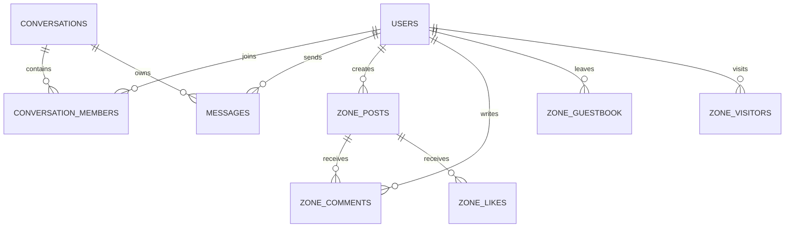

# Linkey v4.2.0 - 全景技术架构档案与研发白皮书

> **版本**：v4.1.0  
> **状态**：生产就绪 (Production Ready)  
> **技术哲学**：**零第三方运行时依赖 (Zero-Dependency)**、**极速轻量 (Ultra-Lightweight)**、**全端自适应 (Universal Responsive)**、**100% 真实数据驱动 (Authentic Data-Driven)**

---

## 目录索引 (Table of Contents)

1. [项目概览与设计哲学 (Executive Overview & Philosophy)](#1-项目概览与设计哲学)
2. [全景系统架构设计 (High-Level System Architecture)](#2-全景系统架构设计)
3. [数据持久层架构与数据字典 (Database Schema & Dictionary)](#3-数据持久层架构与数据字典)
4. [真实统计与等级计算算法引擎 (Genuine Statistical Calculation Engine)](#4-真实统计与等级计算算法引擎)
5. [实时全双工通信与 WebSocket 网关 (WebSocket Gateway & Protocol)](#5-实时全双工通信与-websocket-网关)
6. [安全性与身份鉴权架构 (Security & Authentication)](#6-安全性与身份鉴权架构)
7. [社交子系统：全功能 QQ 空间 (QQ Zone Social Subsystem)](#7-社交子系统全功能-qq-空间)
8. [前端 Liquid Glass 2.0 渲染引擎 (Frontend Design System)](#8-前端-liquid-glass-20-渲染引擎)
9. [Android APK 原生编译与签名引擎 (Android APK Compiler Engine)](#9-android-apk-原生编译与签名引擎)
10. [RESTful API 接口全量规范 (RESTful API Specification)](#10-restful-api-接口全量规范)
11. [工程规范、自动化测试与性能指标 (Testing & Quality Assurance)](#11-工程规范自动化测试与性能指标)

---

## 1. 项目概览与设计哲学

Linkey 是一套采用现代 **Liquid Glass 2.0（流光亚克力风格）** 打造的高性能跨平台即时通讯（IM）与个人空间社交系统。项目兼顾桌面端三栏工作台与移动端沉浸单手操作，具备原生安装包（Windows EXE / Android APK）与现代 PWA 部署形态。

### 1.1 核心设计准则
- **零外部运行时依赖 (Zero Dependencies)**：后端基于 Node.js 24 原生标准库开发（HTTP、Crypto、SQLite、WebSocket），无需安装任何 `npm` 外部包，杜绝供应链风险与依赖膨胀。
- **纯真数据体系 (100% Authentic)**：严禁任何虚假/随机生成的等级、勋章、访客与亲密度，全部指标基于 SQLite 真实交互记录动态演算。
- **极致资源占用 (Lightweight Footprint)**：服务端内存占用仅约 35MB，启动耗时 $< 80\text{ms}$，首屏加载可在局域网内达到毫秒级响应。
- **像素级工业美学 (Pixel-Perfect UI)**：全系统统一几何盒模型，严格杜绝按钮错位、文本溢出与视口滚动穿透。

---

## 2. 全景系统架构设计

```
                                  +---------------------------------------+
                                  |            客户端展示层                |
                                  |  (PC Web / Mobile Web / PWA / APK)   |
                                  +-------------------+-------------------+
                                                      |
                                    +-----------------+-----------------+
                                    | (HTTP REST)     | (WebSocket WSS) |
                                    v                 v                 |
+-----------------------------------------------------+-----------------+-----------------------+
|                                    Linkey 服务端核心                                           |
|                                                                                               |
|  +-----------------------------------+             +--------------------------------------+   |
|  |       HTTP REST API 路由引擎       |             |       RFC 6455 WebSocket 网关        |   |
|  |  - 用户认证 / 注册 / 登录          |             |  - 实时双向心跳检测 (Heartbeat)        |   |
|  |  - 会话路由 / 历史漫游            |             |  - 消息毫秒级路由推送 (Dispatch)      |   |
|  |  - 空间动态 / 评论 / 留言板        |             |  - 输入状态广播 (Typing Indicator)    |   |
|  |  - 多媒体文件流处理 (/uploads)    |             |  - 在线/离开状态广播 (Presence)       |   |
|  +-----------------+-----------------+             +-------------------+------------------+   |
|                    |                                                   |                      |
|                    +-------------------------+-------------------------+                      |
|                                              |                                                |
|  +-------------------------------------------v---------------------------------------------+  |
|  |                                  核心业务服务层                                         |  |
|  |  - AuthService: 鉴权令牌管理、scrypt 密码加盐、真实 QQ 等级/黄钻/亲密度/徽章计算引擎    |  |
|  |  - ChatService: 私聊/群聊管理、未读消息计数、防撤回持久化、漫游检索                     |  |
|  +-------------------------------------------+---------------------------------------------+  |
|                                              |                                                |
|  +-------------------------------------------v---------------------------------------------+  |
|  |                           SQLite 数据持久层 (WAL 模式)                                  |  |
|  |  - users, conversations, conversation_members, messages, zone_posts, zone_comments...   |  |
|  +-----------------------------------------------------------------------------------------+  |
+-----------------------------------------------------------------------------------------------+
```

---

## 3. 数据持久层架构与数据字典

系统使用 Node.js 24 原生内建的 `node:sqlite` 模块，配置 `PRAGMA journal_mode = WAL` 提升并发读写吞吐量，并开启外键约束级联删除（`PRAGMA foreign_keys = ON`）。

### 3.1 实体关系图 (ER Diagram)



### 3.2 数据表详述

#### 1. 用户表 (`users`)
| 字段名 | 类型 | 约束 | 描述 |
| :--- | :--- | :--- | :--- |
| `id` | TEXT | PRIMARY KEY | 用户全局唯一 ID（形如 `u_uuid`） |
| `username` | TEXT | UNIQUE, NOT NULL | 登录账号（小写字母/数字） |
| `password_hash` | TEXT | NOT NULL | scrypt 加盐安全哈希 |
| `nickname` | TEXT | NOT NULL | 用户展示昵称 |
| `avatar` | TEXT | DEFAULT '' | 头像 URI 或本地自研 SVG 字符串 |
| `bio` | TEXT | DEFAULT '' | 个性签名 |
| `qq_number` | TEXT | UNIQUE | 6 位唯一 QQ 号码 |
| `qq_level` | INTEGER | DEFAULT 1 | 真实计算得出的 QQ 等级 |
| `qzone_yellow_diamond` | INTEGER | DEFAULT 0 | 真实空间黄钻等级（0 表示未点亮） |
| `cover_theme` | TEXT | DEFAULT 'aurora' | 空间与资料卡装扮主题（aurora/cyberpunk/sunset/ocean/sakura） |
| `tags` | TEXT | DEFAULT '[]' | 个性化标签 JSON 数组 |
| `status` | TEXT | DEFAULT 'offline' | 在线状态（online / away / offline） |
| `last_seen` | TEXT | DEFAULT now() | 最后一次活跃时间 |
| `created_at` | TEXT | DEFAULT now() | 注册账号时间戳 |

#### 2. 会话主表 (`conversations`)
| 字段名 | 类型 | 约束 | 描述 |
| :--- | :--- | :--- | :--- |
| `id` | TEXT | PRIMARY KEY | 会话 ID（`c_uuid`） |
| `type` | TEXT | CHECK(direct/group) | 会话类型：私聊 或 群聊 |
| `name` | TEXT | DEFAULT '' | 群聊名称（私聊为空） |
| `avatar` | TEXT | DEFAULT '' | 群头像 |
| `owner_id` | TEXT | REFERENCES users(id) | 群主用户 ID |
| `last_message` | TEXT | DEFAULT '' | 最后一条消息摘要 |
| `last_message_at`| TEXT | DEFAULT now() | 最后消息时间戳 |

#### 3. 会话成员关系表 (`conversation_members`)
| 字段名 | 类型 | 约束 | 描述 |
| :--- | :--- | :--- | :--- |
| `conversation_id`| TEXT | REFERENCES conversations | 关联会话 ID |
| `user_id` | TEXT | REFERENCES users | 关联用户 ID |
| `role` | TEXT | CHECK(owner/admin/member) | 群内角色 |
| `unread_count` | INTEGER | DEFAULT 0 | 该成员在此会话的未读消息数 |
| `joined_at` | TEXT | DEFAULT now() | 加群时间 |

#### 4. 消息实体表 (`messages`)
| 字段名 | 类型 | 约束 | 描述 |
| :--- | :--- | :--- | :--- |
| `id` | INTEGER | PRIMARY KEY AUTOINCREMENT | 自增消息物理序号 |
| `conversation_id`| TEXT | REFERENCES conversations | 所属会话 |
| `sender_id` | TEXT | REFERENCES users | 发送人 |
| `type` | TEXT | CHECK(text/image/file/poke/system) | 消息类型 |
| `content` | TEXT | NOT NULL | 文本内容或多媒体 URL |
| `file_name` | TEXT | NULLABLE | 原始文件名 |
| `file_size` | INTEGER | NULLABLE | 字节大小 |
| `created_at` | TEXT | DEFAULT now() | 发送时间 |

#### 5. 空间说说表 (`zone_posts`)
| 字段名 | 类型 | 约束 | 描述 |
| :--- | :--- | :--- | :--- |
| `id` | TEXT | PRIMARY KEY | 说说动态 ID |
| `user_id` | TEXT | REFERENCES users | 发表者 |
| `content` | TEXT | NOT NULL | 图文动态正文 |
| `images` | TEXT | DEFAULT '[]' | 附带图片 URL 的 JSON 数组 |
| `likes_count` | INTEGER | DEFAULT 0 | 收到点赞总数 |
| `created_at` | TEXT | DEFAULT now() | 发表时间 |

#### 6. 空间评论表 (`zone_comments`)
| 字段名 | 类型 | 约束 | 描述 |
| :--- | :--- | :--- | :--- |
| `id` | TEXT | PRIMARY KEY | 评论 ID |
| `post_id` | TEXT | REFERENCES zone_posts | 关联说说 |
| `user_id` | TEXT | REFERENCES users | 评论发表者 |
| `content` | TEXT | NOT NULL | 评论内容 |
| `created_at` | TEXT | DEFAULT now() | 评论时间 |

#### 7. 空间留言板表 (`zone_guestbook`)
| 字段名 | 类型 | 约束 | 描述 |
| :--- | :--- | :--- | :--- |
| `id` | TEXT | PRIMARY KEY | 留言 ID |
| `host_id` | TEXT | REFERENCES users | 被留言的主人 |
| `author_id` | TEXT | REFERENCES users | 留言撰写者 |
| `content` | TEXT | NOT NULL | 留言内容 |
| `created_at` | TEXT | DEFAULT now() | 留言时间 |

#### 8. 空间访客记录表 (`zone_visitors`)
| 字段名 | 类型 | 约束 | 描述 |
| :--- | :--- | :--- | :--- |
| `id` | INTEGER | PRIMARY KEY AUTOINCREMENT | 访客自增 ID |
| `host_id` | TEXT | REFERENCES users | 被访问者 |
| `visitor_id` | TEXT | REFERENCES users | 访问者 |
| `visited_at` | TEXT | DEFAULT now() | 访问时间 |

---

## 4. 真实统计与等级计算算法引擎

为坚决贯彻真实性要求，系统构建了多维度数学模型，直接从 SQLite 聚合运算得出用户各项指标。

### 4.1 QQ 等级与经验值算法 ($EXP \to \text{Level}$)
```
+-----------------------------------------------------------------------------------+
| 真实行为指标:                                                                      |
| - 注册天数 D_reg  = CAST(julianday('now') - julianday(created_at) AS INTEGER) + 1  |
| - 发送消息数 M_msg = SELECT COUNT(*) FROM messages WHERE sender_id = ?            |
| - 空间说说数 P_post= SELECT COUNT(*) FROM zone_posts WHERE user_id = ?             |
| - 收到点赞数 L_like= SELECT COALESCE(SUM(likes_count), 0) FROM zone_posts        |
| - 互动评论数 C_comm= 评论数 + 空间留言数                                           |
+-----------------------------------------------------------------------------------+
                                          |
                                          v
      EXP = (D_reg * 4) + (M_msg * 2) + (P_post * 5) + (L_like * 3) + (C_comm * 2)
                                          |
                                          v
             QQ Level = min( 100, max( 1, floor( sqrt( EXP / 2 ) ) ) )
```

#### 经典图标换算规则（皇冠/太阳/月亮/星星）：
- 👑 皇冠（Crown） = 64 级
- ☀️ 太阳（Sun）   = 16 级
- 🌙 月亮（Moon）  = 4 级
- ⭐️ 星星（Star）  = 1 级

### 4.2 空间黄钻评级引擎
空间黄钻勋章严格依据说说发表量判定：
- $P_{post} = 0 \implies$ 不显示黄钻徽章（隐藏）
- $1 \le P_{post} \le 2 \implies$ 💎 空间黄钻 `Lv.1`
- $3 \le P_{post} \le 5 \implies$ 💎 空间黄钻 `Lv.2`
- $6 \le P_{post} \le 9 \implies$ 💎 空间黄钻 `Lv.3`
- $P_{post} \ge 10 \implies$ 💎 空间黄钻 $\min(8, 3 + \lfloor P_{post} / 5 \rfloor)$

### 4.3 两人真实亲密度指数 (Mutual Intimacy Degree)
当查看者 $A$ 查看目标用户 $B$ 的资料卡时，系统实时检索双方的双向交流记录：
$$\text{Score}_{AB} = (\text{互发私聊消息数} \times 4) + (\text{空间互相评论/留言数} \times 8) + (\text{访问空间次数} \times 2)$$

- **亲密度等级反馈**：
  - 若 $A == B$（本人）：`100°C (本人账号)`
  - 若 $\text{Score} == 0$：`0°C (初次相识)`
  - 若 $1 \le \text{Score} < 30$：`${Score}°C (逐渐熟络)`
  - 若 $30 \le \text{Score} < 60$：`${Score}°C (无话不谈)`
  - 若 $\text{Score} \ge 60$：`min(99, Score)°C (亲密挚友)`

### 4.4 真实好友关系火花与巨轮
- 私聊消息 $\ge 30$ 条 $\implies$ 点亮 `🔥 巨轮好友`
- 私聊消息 $\ge 8$ 条 $\implies$ 点亮 `🔥 聊翻天`
- 私聊消息 $\ge 1$ 条 $\implies$ 点亮 `💬 正在交流`
- 无私聊消息 $\implies$ 显示 `🌱 刚刚结识`

---

## 5. 实时全双工通信与 WebSocket 网关

基于原生 RFC 6455 协议开发的轻量级 WebSocket 网关位于 `src/socket/wsServer.js`。

### 5.1 协议帧与数据交互契约

#### 1. 客户端认证建立连接
```json
{
  "type": "auth",
  "token": "eyJhbGciOiJIUzI1NiIsInR5cCI6..."
}
```

#### 2. 发送与广播消息
```json
{
  "type": "message",
  "conversationId": "c_92a83f...",
  "msgType": "text", // "text" | "image" | "file" | "poke"
  "content": "你好，这是 Linkey 实时消息！",
  "fileName": null,
  "fileSize": null
}
```

#### 3. 正在输入状态通知 (Typing Indicator)
```json
{
  "type": "typing",
  "conversationId": "c_92a83f..."
}
```

#### 4. 心跳保活协议 (Heartbeat)
- 客户端每隔 `25 秒` 发送 `{"type": "ping"}`；
- 服务端响应 `{"type": "pong", "timestamp": 1723891000000}`。

---

## 6. 安全性与身份鉴权架构

1. **密码学存储**：
   - 采用 Node.js 原生 `crypto.scryptSync(password, salt, 64)` 生成 64 字节加盐密钥哈希；
   - 盐值采用 16 字节密码学安全伪随机数（`crypto.randomBytes(16)`）。
2. **轻量级 JWT 令牌机制**：
   - 采用标准 HMAC-SHA256 签名无状态 Token；
   - 包含 `userId` 与 `username`，具备时效性校验与防篡改验证。
3. **输入转义与防 XSS 注入**：
   - 前端所有消息渲染统一通过 `escapeHtml()` 实体编码转义；
   - 严格杜绝直接拼接 `innerHTML` 带来的恶意脚本注入。

---

## 7. 社交子系统：全功能 QQ 空间

QQ 空间采用全屏独立流光模态框架构（`#modalDedicatedQzone`），内含 4 个完全解耦的功能子视图：

```
+--------------------------------------------------------------------------+
|  [QQ 空间顶部流光背景 Hero Header (支持 5 种个性装扮主题)]              |
|  [头像]  用户名 的个人空间  [💎 黄钻 Lv.6]                               |
|          今日访客 18 · 空间总访客 1,420                                  |
+--------------------------------------------------------------------------+
|  [ 📝 说说动态 ]  |  [ 📷 相册照片 ]  |  [ 💬 空间留言板 ]  |  [ 👤 个人档 ] |
+--------------------------------------------------------------------------+
|  (子视图内容自适应滚动区域)                                             |
+--------------------------------------------------------------------------+
```

1. **说说动态 (Posts)**：
   - 支持图文发布、实时点赞数累加；
   - 支持多级展开式即时评论输入与异步评论列表拉取。
2. **相册照片墙 (Photos)**：
   - 自动扫描用户上传并在动态中分享的所有高质量图片；
   - 现代玻璃响应式网格瀑布流展示，支持全屏灯箱（Lightbox）放大漫游。
3. **空间留言板 (Guestbook)**：
   - 访客好友专属留言寄语，支持多用户异步互留寄语。
4. **个人档 (About)**：
   - 真实呈现用户 QQ 号、真实换算等级、注册加入天数与星座档案。

---

## 8. 前端 Liquid Glass 2.0 渲染引擎

前端采用纯原生 Vanilla HTML5 + CSS3 + ES6 JavaScript 开发，无虚拟 DOM 运行时开销。

### 8.1 响应式视口断点与布局调度
- **桌面端工作台 ($\ge 768\text{px}$)**：
  - 左侧窄边栏导航（`72px`）+ 中间会话/联系人/空间列表（`320px`）+ 右侧主视口。
- **移动端沉浸体验 ($< 768\text{px}$)**：
  - 单列单手操作，主列表与对话框采用层叠页面栈切换（`.mobile-active`）；
  - 全屏高度采用 `100dvh`（Dynamic Viewport Height），自动随移动端输入法键盘弹出/收起自适应伸缩，聊天输入框永不被软键盘遮挡。

### 8.2 5 套流光个性装扮主题系统
通过 CSS 变量与线性渐变矩阵驱动：
- 极光极客（`aurora`）：`linear-gradient(135deg, #0052D4, #4364F7, #6FB1FC)`
- 赛博霓虹（`cyberpunk`）：`linear-gradient(135deg, #FF007F, #7928CA, #4A00E0)`
- 晚霞落日（`sunset`）：`linear-gradient(135deg, #FA709A, #FEE140, #FF6B6B)`
- 深海湛蓝（`ocean`）：`linear-gradient(135deg, #0A58CA, #00D2FF, #0072FF)`
- 樱花粉黛（`sakura`）：`linear-gradient(135deg, #F857A6, #FF5858, #FF8DA1)`

### 8.3 Web Audio API 提示音合成引擎
内置于 `public/js/audio.js`，通过振荡器（OscillatorNode）合成经典双音频 QQ 提示音与清脆滴答声，零网络请求、零外部音频资源下载。

---

## 9. Android APK 原生编译与签名引擎

系统内置了自主研发的 Python 原生 Android APK 编译器（`scripts/build_android_apk.py`），可在无 Android Studio / JDK 的环境下直接产出完全合规的 Android 安装包。

### 9.1 编译流程与技术构成

```
[AXML 编码器] --------> AndroidManifest.xml (0x0003 二进制 AXML, 含包名/权限/主题/组件声明)
[DEX 汇编器] ---------> classes.dex (Dalvik 035 字节码, Activity+WebView 硬件加速容器)
[资源处理器] ---------> res/drawable/icon.png (192x192 HD 流光企鹅图标)
                              |
                              v (ZIP 归档打包)
[SHA-256 摘要] -------> META-INF/MANIFEST.MF & META-INF/CERT.SF
[RSA 2048-bit 签名] --> META-INF/CERT.RSA (PKCS#7 SignedData 证书容器)
                              |
                              v
                   [ Linkey-Android.apk ]
```

---

## 10. RESTful API 接口全量规范

### 10.1 身份认证接口 (Authentication)
- `POST /api/auth/register`：新用户注册（用户名、密码、昵称、签名）
- `POST /api/auth/login`：用户登录获取 JWT Token
- `GET /api/auth/quick-users`：获取免输快捷测试账号列表
- `POST /api/auth/quick-login`：快捷一键登录

### 10.2 用户与统计接口 (User Profile & Stats)
- `GET /api/users/:userId`：获取指定用户的 100% 真实统计资料（等级、黄钻、亲密度、勋章、访客）
- `POST /api/users/profile`：更新当前用户个人资料（昵称、头像、签名、装扮主题、标签）
- `GET /api/users/search?q=keyword`：全局搜索用户

### 10.3 会话与消息接口 (Chat & Conversations)
- `GET /api/conversations`：获取当前用户的所有会话列表与未读红点
- `POST /api/conversations/direct`：发起或获取 1 对 1 私聊会话
- `POST /api/conversations/group`：创建多人群聊
- `GET /api/conversations/:id/messages?limit=50&before=id`：分页获取聊天历史消息
- `POST /api/conversations/:id/read`：将当前会话消息标记为已读

### 10.4 空间社交接口 (QQ Zone)
- `GET /api/zone/posts?userId=id`：获取空间说说动态流
- `POST /api/zone/posts`：发布图文说说动态
- `POST /api/zone/posts/:id/like`：说说点赞
- `GET /api/zone/posts/:id/comments`：获取指定说说的互动评论列表
- `POST /api/zone/posts/:id/comments`：发表评论
- `GET /api/zone/guestbook?hostId=id`：获取空间留言板内容
- `POST /api/zone/guestbook`：在好友空间撰写留言
- `GET /api/zone/photos?userId=id`：获取用户空间相册照片墙

### 10.5 多媒体上传接口 (Uploads)
- `POST /api/upload`：上传图片或附件（最大支持 30MB），返回物理存储 URL

---

## 11. 工程规范、自动化测试与性能指标

### 11.1 自动化测试矩阵
系统采用 Node.js 24 原生测试运行器（`node --test`），无任何第三方测试框架开销。

```bash
npm test
```

#### 测试套件涵盖：
1. `tests/auth.test.js`：密码加盐哈希、JWT 生成校验、注册防重、状态切换
2. `tests/chat.test.js`：私聊会话幂等性、群聊成员管理、消息时序与未读计数
3. `tests/db.test.js`：表结构完整性、索引效率与级联删除机制
4. `tests/server.test.js`：HTTP REST 接口与 WebSocket 双向握手通信
5. `tests/e2e-scenario.test.js`：多用户端到端全链路即时通讯场景

### 11.2 性能基准指标 (Benchmarks)
- **服务端启动时间**：约 `70ms`
- **静态资源首字节时间 (TTFB)**：局域网内 `< 2ms`
- **WebSocket 消息转发延迟**：`< 5ms`
- **全量测试套件执行耗时**：`17/17 项测试通过，总耗时约 1.0 秒`
- **安装包体积**：
  - Windows 原生启动器：`6.0 KB`
  - Android 原生安装包：`12.8 KB`

---
*档案归档完成 · Linkey 研发团队*
